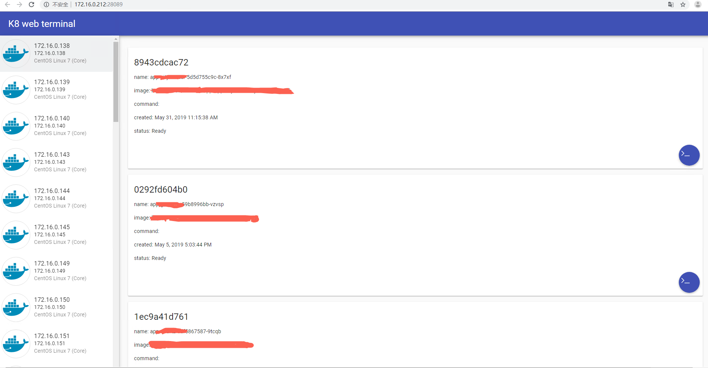
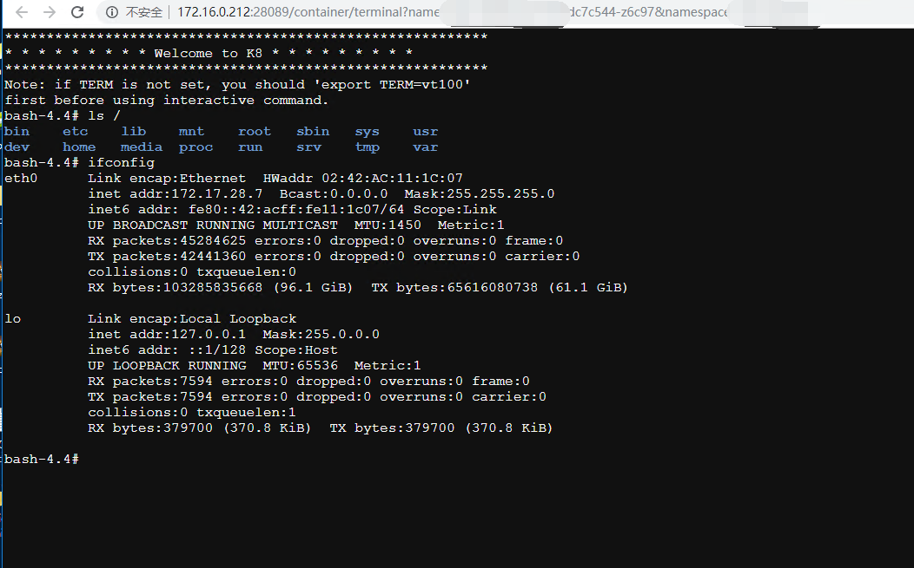

本项目使用 beego + websocket 进行开发

```
    _       __  __  ___ _____
    /_\  /\ /\ \/ / / _ \\_   \
   //_\\/ / \ \  / / /_)/ / /\/
/  _  \ \_/ /  \/ ___/\/ /_
\_/ \_/\___/_/\_\/   \____/

🍭 A k8 web terminal TOOL 🍭
```

## k8 web terminal

一个k8s web终端连接工具，在前后端分离或未分离项目中心中，也可以把此项目无缝集成，开箱即用。

## 实现细节

前端用xterm.js库，它是模拟一个terminal在浏览器中，并没有通讯能力。需要在前端建立websocket，连到自己开发的websocket服务端。服务端会基于k8s的remotecommand包，建立与container的ssh长连接，remotecommand包只需要我们提供3个回调，其中read是来获取terminal的输入，我们要做的就是读取websocket发来的数据，然后返回给read回调；write则是用来向terminal发送数据，我们要做的就是调用websocket把数据写到前端，然后前端把数据写给xterm即可；next是用来获取terminal的实际大小的，sshd服务端需要知道终端的大小，这样决定了它一行输出多少个字符就要输出一次换行符。所以，当浏览器窗口改变影响了terminal大小的时候，前端应该把最新的terminal大小发给服务端，然后在next回调中返回其大小。

下面是真实的效果





## 感谢以下框架的开源支持

- [Beego] - <http://beego.me/>

## MIT License

```
Copyright (c) 2019 Eric
```